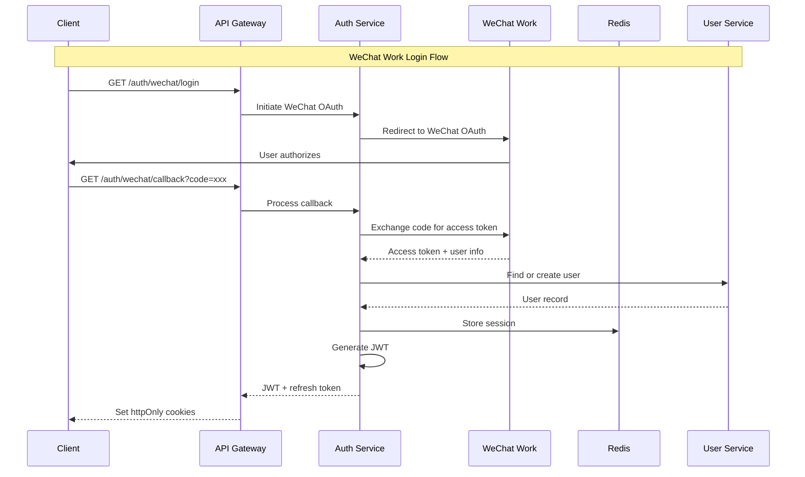

# Backend Architecture

## Service Architecture

### Serverless Architecture

#### Function Organization
```text
apps/api/src/
├── functions/
│   ├── auth/
│   │   ├── login.ts
│   │   ├── refresh.ts
│   │   └── logout.ts
│   ├── projects/
│   │   ├── list.ts
│   │   ├── create.ts
│   │   ├── update.ts
│   │   └── delete.ts
│   └── shared/
│       ├── middleware.ts
│       └── utils.ts
├── services/         # Shared business logic
├── repositories/     # Data access layer
└── infrastructure/   # DB, cache, etc.
```

#### Function Template
```typescript
// functions/projects/create.ts
import { APIGatewayProxyHandler } from 'aws-lambda';
import { middyfy } from '@/shared/middleware';
import { projectService } from '@/services/project.service';
import { CreateProjectDTO } from '@/types';

const handler: APIGatewayProxyHandler = async (event) => {
  try {
    const userId = event.requestContext.authorizer?.userId;
    const projectData: CreateProjectDTO = JSON.parse(event.body || '{}');
    
    const project = await projectService.create(userId, projectData);
    
    return {
      statusCode: 201,
      body: JSON.stringify(project),
    };
  } catch (error) {
    console.error('Create project error:', error);
    return {
      statusCode: error.statusCode || 500,
      body: JSON.stringify({
        error: {
          message: error.message || 'Internal server error',
          code: error.code || 'INTERNAL_ERROR',
        },
      }),
    };
  }
};

export const createProject = middyfy(handler);
```

## Database Architecture

### Schema Design
```sql
-- See Database Schema section above for complete schema

-- Additional indexes for performance
CREATE INDEX idx_projects_search ON projects USING GIN(
  to_tsvector('simple', title || ' ' || COALESCE(title_en, '') || ' ' || description)
);

-- Materialized view for analytics
CREATE MATERIALIZED VIEW project_analytics AS
SELECT 
  p.department,
  DATE_TRUNC('month', p.created_at) as month,
  COUNT(*) as total_projects,
  COUNT(CASE WHEN p.status = 'completed' THEN 1 END) as completed_projects,
  AVG(p.current_students::numeric / p.capacity::numeric) as avg_fill_rate
FROM projects p
GROUP BY p.department, DATE_TRUNC('month', p.created_at);

CREATE INDEX idx_project_analytics_dept_month ON project_analytics(department, month);
```

### Data Access Layer
```typescript
// repositories/project.repository.ts
import { Injectable } from '@nestjs/common';
import { InjectRepository } from '@nestjs/typeorm';
import { Repository } from 'typeorm';
import { Project } from '@/entities/project.entity';
import { ProjectFilters } from '@/types';

@Injectable()
export class ProjectRepository {
  constructor(
    @InjectRepository(Project)
    private readonly repository: Repository<Project>,
  ) {}
  
  async findWithFilters(filters: ProjectFilters, userId?: string) {
    const query = this.repository
      .createQueryBuilder('project')
      .leftJoinAndSelect('project.professor', 'professor')
      .where('project.status = :status', { status: 'published' });
    
    if (filters.department) {
      query.andWhere('project.department = :department', { 
        department: filters.department 
      });
    }
    
    if (filters.tags?.length) {
      query.andWhere('project.tags && :tags', { tags: filters.tags });
    }
    
    if (filters.search) {
      query.andWhere(
        'to_tsvector(\'simple\', project.title || \' \' || project.description) @@ plainto_tsquery(\'simple\', :search)',
        { search: filters.search }
      );
    }
    
    // Add match scores if user is logged in
    if (userId && filters.includeMatchScore) {
      query.addSelect(
        '(SELECT match_score FROM calculate_match_score(project.id, :userId))',
        'matchScore'
      ).setParameter('userId', userId);
    }
    
    return query
      .orderBy('project.createdAt', 'DESC')
      .skip(filters.offset)
      .take(filters.limit)
      .getManyAndCount();
  }
  
  async updateWithOptimisticLock(
    id: string, 
    updates: Partial<Project>,
    expectedVersion: number
  ) {
    const result = await this.repository
      .createQueryBuilder()
      .update(Project)
      .set({
        ...updates,
        version: () => 'version + 1',
        updatedAt: new Date(),
      })
      .where('id = :id AND version = :version', { id, version: expectedVersion })
      .returning('*')
      .execute();
    
    if (result.affected === 0) {
      throw new OptimisticLockError('Project has been modified by another user');
    }
    
    return result.raw[0];
  }
}
```

## Authentication and Authorization

### Auth Flow


### Middleware/Guards
```typescript
// middleware/auth.middleware.ts
import { Injectable, NestMiddleware, UnauthorizedException } from '@nestjs/common';
import { Request, Response, NextFunction } from 'express';
import { JwtService } from '@nestjs/jwt';
import { RedisService } from '@/services/redis.service';

@Injectable()
export class AuthMiddleware implements NestMiddleware {
  constructor(
    private readonly jwtService: JwtService,
    private readonly redisService: RedisService,
  ) {}
  
  async use(req: Request, res: Response, next: NextFunction) {
    const token = this.extractToken(req);
    
    if (!token) {
      throw new UnauthorizedException('No token provided');
    }
    
    try {
      const payload = this.jwtService.verify(token);
      
      // Check if token is blacklisted (for logout)
      const isBlacklisted = await this.redisService.get(`blacklist:${token}`);
      if (isBlacklisted) {
        throw new UnauthorizedException('Token has been revoked');
      }
      
      // Check session validity
      const session = await this.redisService.get(`session:${payload.sessionId}`);
      if (!session) {
        throw new UnauthorizedException('Session expired');
      }
      
      // Attach user to request
      req.user = payload;
      next();
    } catch (error) {
      throw new UnauthorizedException('Invalid token');
    }
  }
  
  private extractToken(req: Request): string | null {
    // Try Authorization header first
    const authHeader = req.headers.authorization;
    if (authHeader?.startsWith('Bearer ')) {
      return authHeader.substring(7);
    }
    
    // Fall back to cookie
    return req.cookies?.accessToken || null;
  }
}

// guards/roles.guard.ts
import { Injectable, CanActivate, ExecutionContext } from '@nestjs/common';
import { Reflector } from '@nestjs/core';
import { ROLES_KEY } from '@/decorators/roles.decorator';

@Injectable()
export class RolesGuard implements CanActivate {
  constructor(private reflector: Reflector) {}
  
  canActivate(context: ExecutionContext): boolean {
    const requiredRoles = this.reflector.getAllAndOverride<string[]>(
      ROLES_KEY,
      [context.getHandler(), context.getClass()]
    );
    
    if (!requiredRoles) {
      return true;
    }
    
    const { user } = context.switchToHttp().getRequest();
    return requiredRoles.some(role => user.roles?.includes(role));
  }
}
```
