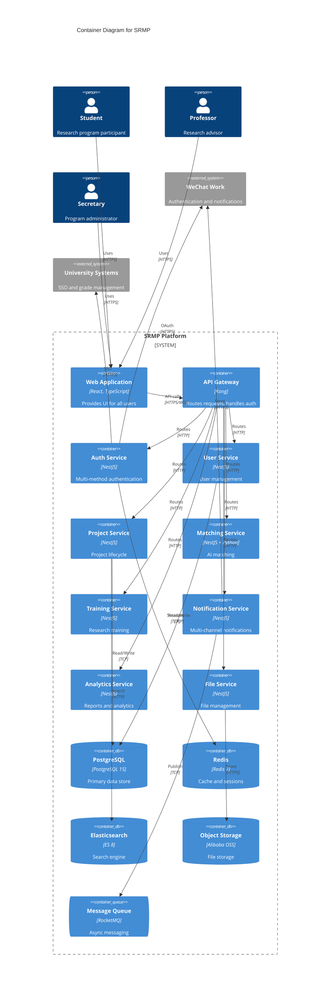

# Components

## API Gateway

**Responsibility:** Single entry point for all client requests, handling routing, authentication, rate limiting, and request/response transformation

**Key Interfaces:**
- HTTP/HTTPS endpoints for all API routes
- WebSocket support for real-time features
- Health check endpoints for monitoring

**Dependencies:** Auth Service, all microservices

**Technology Stack:** Kong API Gateway with custom Lua plugins for WeChat Work integration

## Auth Service

**Responsibility:** Handle multi-method authentication (email, student ID, WeChat Work), JWT token generation/validation, and session management

**Key Interfaces:**
- POST /auth/login (multiple strategies)
- POST /auth/refresh
- POST /auth/logout
- GET /auth/verify

**Dependencies:** Redis (session storage), User Service, WeChat Work API

**Technology Stack:** NestJS with Passport.js strategies, JWT tokens, Redis for sessions

## User Service

**Responsibility:** Manage user profiles, roles, permissions, and program assignments

**Key Interfaces:**
- CRUD operations for users
- Role assignment and permission checking
- Profile completion tracking
- Bulk user import for secretaries

**Dependencies:** PostgreSQL, Redis cache

**Technology Stack:** NestJS with TypeORM, RBAC implementation

## Project Service

**Responsibility:** Handle project lifecycle from creation through completion, including applications and student assignments

**Key Interfaces:**
- Project CRUD with draft/publish workflow
- Application submission and review
- Project-student assignment management
- Project search and filtering

**Dependencies:** PostgreSQL, Elasticsearch, Matching Service

**Technology Stack:** NestJS, TypeORM, Elasticsearch client

## Matching Service

**Responsibility:** AI-powered matching between students and projects based on interests, skills, and prerequisites

**Key Interfaces:**
- POST /match/calculate (get match score)
- GET /match/recommendations (get top matches)
- POST /match/feedback (improve algorithm)

**Dependencies:** AI/ML Service, Project Service, User Service

**Technology Stack:** NestJS with Python ML microservice integration

## Training Service

**Responsibility:** Deliver 12-step research methodology training with progress tracking and certification

**Key Interfaces:**
- Module content delivery
- Progress tracking and quiz scoring
- Certificate generation
- Learning analytics

**Dependencies:** PostgreSQL, File Service (for content storage)

**Technology Stack:** NestJS with video streaming support

## Notification Service

**Responsibility:** Multi-channel notifications via WeChat Work, email, and in-app messages

**Key Interfaces:**
- Send immediate notifications
- Schedule notifications
- Notification preferences management
- Delivery status tracking

**Dependencies:** RocketMQ, WeChat Work API, Email service

**Technology Stack:** NestJS with Bull queue for scheduling

## Analytics Service

**Responsibility:** Generate real-time analytics and reports for all user roles

**Key Interfaces:**
- Dashboard data aggregation
- Custom report generation
- Export functionality (PDF, Excel)
- Predictive analytics for at-risk projects

**Dependencies:** PostgreSQL, Elasticsearch, all other services

**Technology Stack:** NestJS with Apache ECharts for visualizations

## File Service

**Responsibility:** Handle file uploads, version control, and secure access for research deliverables

**Key Interfaces:**
- Multipart file upload
- Version management
- Secure download URLs
- File metadata management

**Dependencies:** Alibaba OSS, PostgreSQL (metadata)

**Technology Stack:** NestJS with OSS SDK, virus scanning integration

## Component Diagrams

