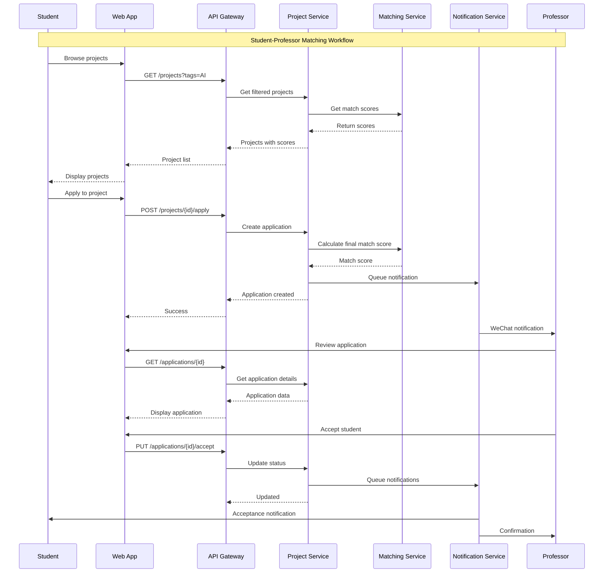
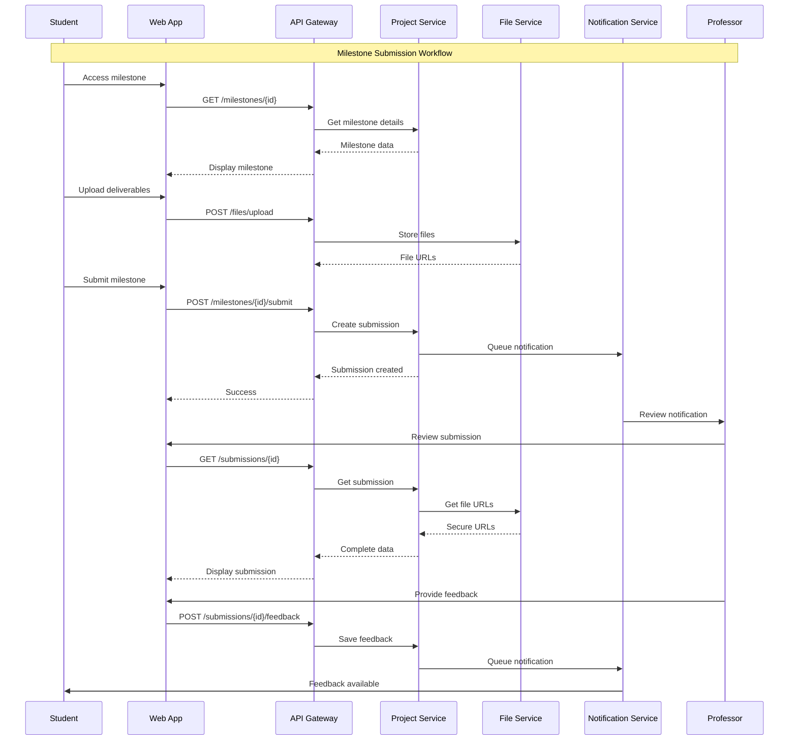

# Core Workflows

```mermaid
sequenceDiagram
    participant S as Student
    participant W as Web App
    participant G as API Gateway
    participant P as Project Service
    participant M as Matching Service
    participant N as Notification Service
    participant Prof as Professor
    
    Note over S,Prof: Student-Professor Matching Workflow
    
    S->>W: Browse projects
    W->>G: GET /projects?tags=AI
    G->>P: Get filtered projects
    P->>M: Get match scores
    M-->>P: Return scores
    P-->>G: Projects with scores
    G-->>W: Project list
    W-->>S: Display projects
    
    S->>W: Apply to project
    W->>G: POST /projects/{id}/apply
    G->>P: Create application
    P->>M: Calculate final match score
    M-->>P: Match score
    P->>N: Queue notification
    P-->>G: Application created
    G-->>W: Success
    
    N->>Prof: WeChat notification
    Prof->>W: Review application
    W->>G: GET /applications/{id}
    G->>P: Get application details
    P-->>G: Application data
    G-->>W: Display application
    
    Prof->>W: Accept student
    W->>G: PUT /applications/{id}/accept
    G->>P: Update status
    P->>N: Queue notifications
    P-->>G: Updated
    N->>S: Acceptance notification
    N->>Prof: Confirmation
```

```mermaid
sequenceDiagram
    participant S as Student
    participant W as Web App
    participant G as API Gateway
    participant P as Project Service
    participant F as File Service
    participant N as Notification Service
    participant Prof as Professor
    
    Note over S,Prof: Milestone Submission Workflow
    
    S->>W: Access milestone
    W->>G: GET /milestones/{id}
    G->>P: Get milestone details
    P-->>G: Milestone data
    G-->>W: Display milestone
    
    S->>W: Upload deliverables
    W->>G: POST /files/upload
    G->>F: Store files
    F-->>G: File URLs
    
    S->>W: Submit milestone
    W->>G: POST /milestones/{id}/submit
    G->>P: Create submission
    P->>N: Queue notification
    P-->>G: Submission created
    G-->>W: Success
    
    N->>Prof: Review notification
    Prof->>W: Review submission
    W->>G: GET /submissions/{id}
    G->>P: Get submission
    P->>F: Get file URLs
    F-->>P: Secure URLs
    P-->>G: Complete data
    G-->>W: Display submission
    
    Prof->>W: Provide feedback
    W->>G: POST /submissions/{id}/feedback
    G->>P: Save feedback
    P->>N: Queue notification
    N->>S: Feedback available
```
