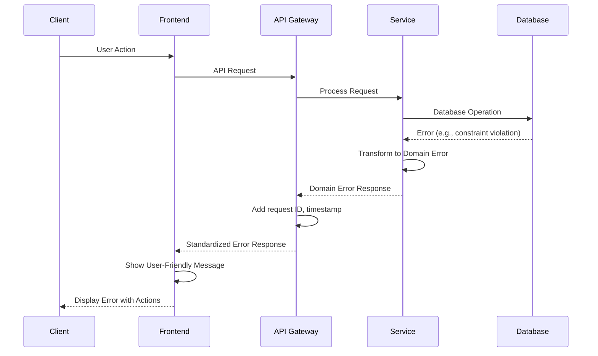

# Error Handling Strategy

## Error Flow


## Error Response Format
```typescript
interface ApiError {
  error: {
    code: string;
    message: string;
    details?: Record<string, any>;
    timestamp: string;
    requestId: string;
  };
}
```

## Frontend Error Handling
```typescript
// hooks/useErrorHandler.ts
import { useCallback } from 'react';
import { notification } from 'antd';
import { useTranslation } from 'react-i18next';

export const useErrorHandler = () => {
  const { t } = useTranslation();
  
  const handleError = useCallback((error: any) => {
    console.error('Error occurred:', error);
    
    // Network errors
    if (!error.response) {
      notification.error({
        message: t('errors.network.title'),
        description: t('errors.network.description'),
      });
      return;
    }
    
    // API errors
    const { code, message } = error.response.data.error;
    
    const errorMessages: Record<string, string> = {
      'AUTH_INVALID_CREDENTIALS': t('errors.auth.invalidCredentials'),
      'AUTH_TOKEN_EXPIRED': t('errors.auth.tokenExpired'),
      'VALIDATION_FAILED': t('errors.validation.failed'),
      'RESOURCE_NOT_FOUND': t('errors.resource.notFound'),
      'PERMISSION_DENIED': t('errors.permission.denied'),
      'RATE_LIMIT_EXCEEDED': t('errors.rateLimit.exceeded'),
    };
    
    notification.error({
      message: t('errors.common.title'),
      description: errorMessages[code] || message,
    });
  }, [t]);
  
  return { handleError };
};
```

## Backend Error Handling
```typescript
// common/filters/http-exception.filter.ts
import {
  ExceptionFilter,
  Catch,
  ArgumentsHost,
  HttpException,
  HttpStatus,
  Logger,
} from '@nestjs/common';
import { Request, Response } from 'express';
import { v4 as uuidv4 } from 'uuid';

@Catch()
export class AllExceptionsFilter implements ExceptionFilter {
  private readonly logger = new Logger(AllExceptionsFilter.name);
  
  catch(exception: unknown, host: ArgumentsHost) {
    const ctx = host.switchToHttp();
    const response = ctx.getResponse<Response>();
    const request = ctx.getRequest<Request>();
    const requestId = uuidv4();
    
    let status = HttpStatus.INTERNAL_SERVER_ERROR;
    let code = 'INTERNAL_ERROR';
    let message = 'An unexpected error occurred';
    let details = {};
    
    if (exception instanceof HttpException) {
      status = exception.getStatus();
      const exceptionResponse = exception.getResponse();
      
      if (typeof exceptionResponse === 'object') {
        code = exceptionResponse['code'] || code;
        message = exceptionResponse['message'] || message;
        details = exceptionResponse['details'] || details;
      }
    }
    
    // Log error with context
    this.logger.error({
      requestId,
      method: request.method,
      url: request.url,
      userId: request.user?.id,
      error: exception,
    });
    
    response.status(status).json({
      error: {
        code,
        message,
        details,
        timestamp: new Date().toISOString(),
        requestId,
      },
    });
  }
}

// domain/errors/domain-error.ts
export class DomainError extends Error {
  constructor(
    public readonly code: string,
    public readonly message: string,
    public readonly details?: Record<string, any>,
  ) {
    super(message);
    this.name = this.constructor.name;
  }
}

export class ValidationError extends DomainError {
  constructor(details: Record<string, string[]>) {
    super('VALIDATION_FAILED', 'Validation failed', details);
  }
}

export class NotFoundError extends DomainError {
  constructor(resource: string, id: string) {
    super('RESOURCE_NOT_FOUND', `${resource} not found`, { resource, id });
  }
}

export class PermissionError extends DomainError {
  constructor(action: string, resource: string) {
    super('PERMISSION_DENIED', 'Permission denied', { action, resource });
  }
}
```
