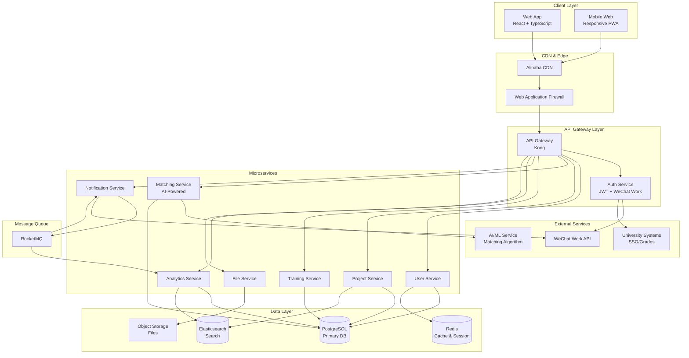

# High Level Architecture

## Technical Summary

SRMP employs a microservices architecture within a monorepo structure, with React-based frontend and Node.js backend services deployed on Alibaba Cloud. The frontend uses Ant Design for UI components aligned with Chinese design patterns, while the backend implements RESTful APIs with GraphQL for complex queries. Integration points include WeChat Work authentication, university SSO systems, and real-time notifications via WebSocket. The architecture prioritizes the "three-step operation" principle through streamlined API design and intelligent caching, achieving PRD goals of 40% administrative overhead reduction through automation and real-time monitoring capabilities.

## Platform and Infrastructure Choice

**Platform:** Alibaba Cloud (阿里云)
**Key Services:** ECS (Elastic Compute Service), RDS (PostgreSQL), OSS (Object Storage), CDN, API Gateway, Function Compute (Serverless), Message Queue, Elasticsearch Service
**Deployment Host and Regions:** Primary: China (Beijing - cn-beijing), Secondary: China (Shanghai - cn-shanghai) for disaster recovery

## Repository Structure

**Structure:** Monorepo
**Monorepo Tool:** Nx (with pnpm workspaces)
**Package Organization:** Apps (web, api-gateway, microservices), Packages (shared types, utilities, UI components), Infrastructure (IaC templates)

## High Level Architecture Diagram

## Architectural Patterns

- **Microservices Architecture:** Independent services for scalability and team autonomy - _Rationale:_ Supports 10,000 concurrent users and allows independent scaling of high-traffic services
- **API Gateway Pattern:** Centralized entry point with Kong for routing, auth, rate limiting - _Rationale:_ Simplifies client integration and provides consistent security policies
- **Event-Driven Architecture:** RocketMQ for async operations and service decoupling - _Rationale:_ Enables real-time notifications and improves system resilience
- **BFF (Backend for Frontend):** Tailored API responses for web vs future mobile apps - _Rationale:_ Optimizes payload size and reduces client-side complexity
- **Repository Pattern:** Abstract data access in each microservice - _Rationale:_ Enables testing and potential future database migrations
- **CQRS for Analytics:** Separate read models for complex queries - _Rationale:_ Optimizes performance for data-heavy dashboards
- **Component-Based UI:** Atomic design with shared component library - _Rationale:_ Ensures UI consistency and accelerates development
- **State Management Pattern:** Zustand for client state, React Query for server state - _Rationale:_ Simplifies state logic and improves cache management
