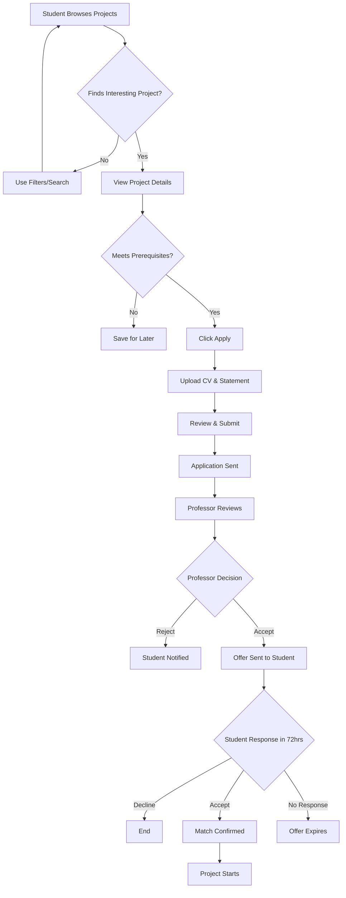
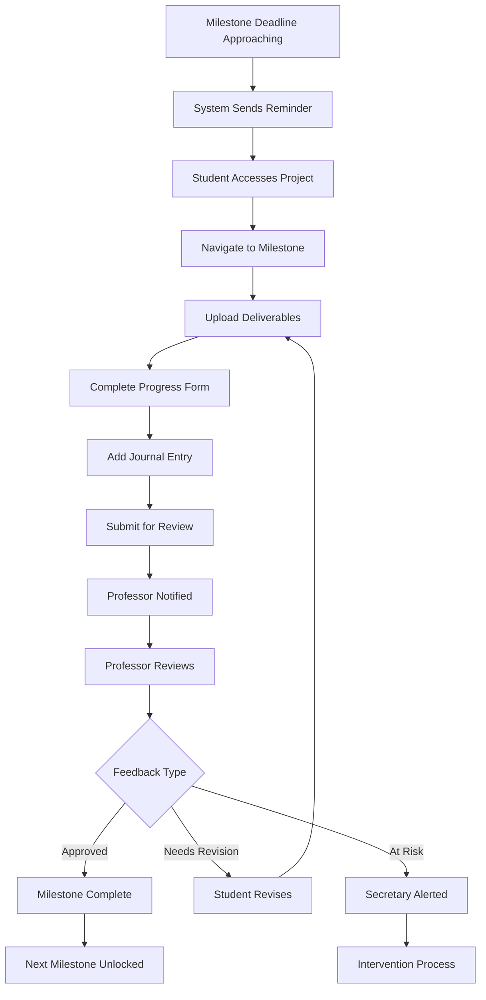
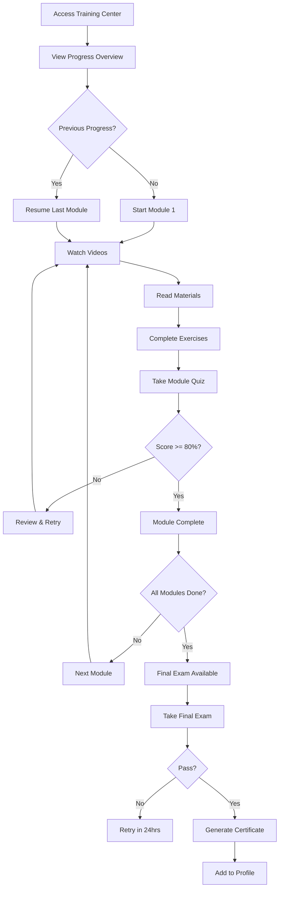

# Scientific Research Management Platform (SRMP) UI/UX Specification

## Introduction

This document defines the user experience goals, information architecture, user flows, and visual design specifications for Scientific Research Management Platform (SRMP)'s user interface. It serves as the foundation for visual design and frontend development, ensuring a cohesive and user-centered experience.

### Overall UX Goals & Principles

#### Target User Personas

**Student Researcher:** Elite undergraduate students (ages 18-22) in Qiming/Innovation programs who need structured guidance for research development, clear visibility into requirements, and efficient advisor matching

**Professor/Advisor:** Faculty members with limited time who need to quickly identify high-potential students, minimize administrative overhead, and focus on quality mentoring interactions

**Research Secretary:** Administrative staff managing 100+ projects who need real-time visibility, automated alerts for at-risk projects, and efficient batch processing capabilities

**Administrator/Leader:** System managers who need comprehensive analytics, data-driven insights for program optimization, and evidence for funding/accreditation

#### Usability Goals

- **Immediate Task Completion:** New users can complete core tasks (project browsing, application submission) within 5 minutes
- **Three-Step Efficiency:** All major workflows follow the "three-step operation" principle (initiate → confirm → complete)
- **Proactive Guidance:** System prevents errors through clear validation, smart defaults, and contextual help
- **Zero Re-learning:** Interface uses consistent patterns so infrequent users can return without confusion
- **Inclusive Access:** WCAG AA compliance ensures all users can effectively use the platform

#### Design Principles

1. **Role-Optimized Simplicity** - Each user sees only what's relevant to their role, reducing cognitive load
2. **Data at a Glance** - Critical information visible through dashboards, charts, and status indicators without drilling down
3. **Bilingual Flexibility** - Seamless Chinese/English switching with culturally appropriate UI patterns
4. **Academic Professionalism** - Design reflects the prestige of elite universities while remaining approachable for students
5. **Intervention by Exception** - Automated workflows run smoothly, only surfacing issues that need human attention

### Change Log

| Date | Version | Description | Author |
|------|---------|-------------|--------|
| 2025-07-30 | 1.0 | Initial UI/UX specification based on PRD | Sally (UX Expert) |

## Information Architecture (IA)

### Site Map / Screen Inventory

```mermaid
graph TD
    A[Landing/Login] --> B{Role-Based Dashboard}
    B --> S[Student Portal]
    B --> P[Professor Portal]
    B --> R[Research Secretary Portal]
    B --> AD[Admin Portal]
    
    S --> S1[My Dashboard]
    S --> S2[Discover Projects]
    S --> S3[My Applications]
    S --> S4[Active Projects]
    S --> S5[Research Training]
    S --> S6[Profile & Settings]
    
    S1 --> S1a[Progress Overview]
    S1 --> S1b[Upcoming Deadlines]
    S1 --> S1c[Notifications]
    
    S2 --> S2a[Browse Projects]
    S2 --> S2b[Search & Filter]
    S2 --> S2c[Recommended Matches]
    S2 --> S2d[Saved Projects]
    
    S4 --> S4a[Project Details]
    S4 --> S4b[Milestone Tracker]
    S4 --> S4c[Research Journal]
    S4 --> S4d[Discussions]
    S4 --> S4e[File Repository]
    
    S5 --> S5a[12-Step Methodology]
    S5 --> S5b[My Progress]
    S5 --> S5c[Certificates]
    
    P --> P1[Professor Dashboard]
    P --> P2[My Projects]
    P --> P3[Student Applications]
    P --> P4[Progress Monitoring]
    P --> P5[Analytics]
    
    P2 --> P2a[Create Project]
    P2 --> P2b[Manage Projects]
    P2 --> P2c[Project Templates]
    
    P3 --> P3a[Application Inbox]
    P3 --> P3b[Review Interface]
    P3 --> P3c[Comparison Tool]
    
    R --> R1[Secretary Dashboard]
    R --> R2[Project Overview]
    R --> R3[At-Risk Monitor]
    R --> R4[Batch Operations]
    R --> R5[Reports]
    
    AD --> AD1[Admin Dashboard]
    AD --> AD2[User Management]
    AD --> AD3[System Config]
    AD --> AD4[Analytics Suite]
    AD --> AD5[Audit Logs]
```

### Navigation Structure

**Primary Navigation:** Role-specific horizontal navigation bar with 5-6 main sections per role, using icons + text labels. Persistent across all pages with active state indicators.

**Secondary Navigation:** Left sidebar within each main section showing subsections and related tools. Collapsible on smaller screens to maximize content area.

**Breadcrumb Strategy:** Show full path from role dashboard (e.g., "Student Portal > Active Projects > AI Research Project > Milestone 2"). Clickable for easy navigation back. Hidden on mobile to save space.

## User Flows

### Student-Professor Matching Flow

**User Goal:** Successfully match students with appropriate research projects and advisors

**Entry Points:** Student Dashboard, Project Discovery page, Email notification link

**Success Criteria:** Student and professor mutually confirm match within 72 hours

#### Flow Diagram

#### Edge Cases & Error Handling:
- Student exceeds 5 concurrent applications limit - Show error with current applications list
- CV upload fails - Retry with progress indicator, allow alternate formats
- Statement exceeds character limit - Real-time counter, prevent submission until corrected
- Professor doesn't respond - Auto-reminder at 48hrs, escalate to secretary at 7 days
- System matching score conflicts with professor preference - Professor decision is final

**Notes:** The matching algorithm runs continuously in background, updating "Recommended for you" section based on student profile changes

### Progress Tracking Flow

**User Goal:** Students submit milestone deliverables and professors provide timely feedback

**Entry Points:** Project dashboard, Email reminder, Push notification

**Success Criteria:** Milestone approved within review deadline, project stays "green" status

#### Flow Diagram

#### Edge Cases & Error Handling:
- Large file upload timeout - Chunked upload with resume capability
- Concurrent editing conflict - Lock mechanism with "Someone else is editing" message
- Professor provides no feedback - Escalate after 72 hours
- Student disputes feedback - Escalation path to department head

**Notes:** All submissions maintain version history for academic integrity

### Research Methodology Training Flow

**User Goal:** Complete 12-step research methodology training and earn certificate

**Entry Points:** Student dashboard prompt, Direct navigation, Prerequisite link from project

**Success Criteria:** Pass all module assessments with 80%+, complete final exam, receive certificate

#### Flow Diagram

#### Edge Cases & Error Handling:
- Internet disconnection during quiz - Save answers locally, auto-resume
- Module prerequisites not met - Clear message with link to required module
- Certificate generation fails - Queue for regeneration, email when ready
- User needs accessibility accommodations - Extended time, screen reader support

**Notes:** Progress syncs across devices, allowing mobile learning

## Wireframes & Mockups

**Primary Design Files:** [Figma - SRMP Design System](https://figma.com/file/xxxxx)

### Key Screen Layouts

#### Student Dashboard

**Purpose:** Provide at-a-glance view of all research activities and pending actions

**Key Elements:**
- Welcome banner with name and program (Qiming/Innovation)
- Action cards for urgent tasks (applications, deadlines)
- Progress visualization for active projects
- Quick access to training modules
- Recent notifications feed

**Interaction Notes:** Cards use hover states to show additional quick actions. Clicking anywhere on card navigates to detail view. Drag to reorder dashboard modules based on preference.

**Design File Reference:** [Figma - Student Dashboard Frames 1-5]

#### Project Discovery Page

**Purpose:** Enable efficient browsing and filtering of available research opportunities

**Key Elements:**
- Search bar with auto-suggest for topics, professors, departments
- Filter sidebar: department, commitment level, prerequisites, project type
- Project cards: title, professor photo/name, brief description, match score
- Sorting options: newest, deadline, best match, popularity
- Save project button on each card

**Interaction Notes:** Filters apply instantly with smooth animations. Saved projects show filled bookmark icon. Match score displays as percentage with color coding (green 80%+, yellow 50-79%, grey <50%).

**Design File Reference:** [Figma - Project Discovery Frames 10-13]

#### Professor Application Review

**Purpose:** Streamline the evaluation process for student applications

**Key Elements:**
- Inbox with unread count badge
- Bulk action toolbar: accept all, reject all, export
- Student cards: photo, name, major, GPA, match score
- Quick preview on hover: key qualifications
- Detailed view: full application, CV viewer, notes field
- Comparison mode toggle

**Interaction Notes:** Keyboard shortcuts for quick review (A=accept, R=reject, N=next). Swipe gestures on mobile for accept/reject. Auto-save notes every 10 seconds.

**Design File Reference:** [Figma - Professor Review Frames 20-24]

#### Progress Milestone Tracker

**Purpose:** Visual representation of research project progression

**Key Elements:**
- Timeline visualization with milestone nodes
- Current milestone highlighted with details panel
- File upload drop zone
- Progress form with rich text editor
- Status indicator (on-track, delayed, at-risk)
- Submission history accordion

**Interaction Notes:** Milestone nodes are clickable to view historical submissions. Drag-and-drop for file upload with progress bar. Auto-save draft every 30 seconds.

**Design File Reference:** [Figma - Progress Tracker Frames 30-33]

## Component Library / Design System

**Design System Approach:** Extend Ant Design (antd) component library with custom theme and additional components specific to academic workflows. This provides robust, accessible components while maintaining consistency with Chinese design patterns.

### Core Components

#### Status Badge

**Purpose:** Consistent visual indication of project/application/user status across the platform

**Variants:** Success (green), Warning (yellow), Error (red), Info (blue), Neutral (grey)

**States:** Default, Pulsing (for alerts), Disabled

**Usage Guidelines:** Always pair with text label for accessibility. Use pulsing only for time-sensitive alerts. Position consistently in top-right of cards.

#### Progress Ring

**Purpose:** Show completion percentage for milestones, training modules, and profile completion

**Variants:** Small (24px), Medium (48px), Large (120px)

**States:** Empty, In Progress, Complete, Overdue

**Usage Guidelines:** Include percentage text in center for medium and large sizes. Use consistent colors: blue for in-progress, green for complete, red for overdue.

#### User Avatar Group

**Purpose:** Display multiple users involved in a project or discussion

**Variants:** Stacked (overlapping), Grid (separated), With names

**States:** Default, Hover (expand), Overflow (+N more)

**Usage Guidelines:** Maximum 5 avatars shown before overflow. Hovering shows tooltip with full name and role. Clicking opens user list modal.

#### Timeline Node

**Purpose:** Represent milestones, events, and activities in chronological order

**Variants:** Pending, Active, Complete, Failed, Locked

**States:** Default, Hover, Selected, Pulsing (current)

**Usage Guidelines:** Connect with lines showing progression. Include date/time stamps. Active node should be 20% larger. Support both vertical and horizontal orientations.

#### Action Card

**Purpose:** Clickable card component for primary actions and navigation

**Variants:** Default, Featured (with gradient border), Compact

**States:** Default, Hover, Active, Disabled, Loading

**Usage Guidelines:** Always include icon, title, and description. Hover state elevates with shadow. Loading state shows skeleton screen. Featured variant only for 1-2 most important actions.

## Branding & Style Guide

### Visual Identity

**Brand Guidelines:** Align with university brand standards while maintaining modern, approachable feel for student audience

### Color Palette

| Color Type | Hex Code | Usage |
|------------|----------|--------|
| Primary | #1890FF | Primary buttons, links, active states |
| Secondary | #52C41A | Success states, approved status, positive feedback |
| Accent | #FA8C16 | Warnings, deadlines approaching, important notices |
| Success | #52C41A | Positive feedback, confirmations |
| Warning | #FAAD14 | Cautions, important notices |
| Error | #F5222D | Errors, destructive actions |
| Neutral | #F0F2F5, #D9D9D9, #8C8C8C | Text, borders, backgrounds |

### Typography

#### Font Families
- **Primary:** -apple-system, BlinkMacSystemFont, 'Segoe UI', Roboto, 'PingFang SC', 'Microsoft YaHei'
- **Secondary:** Same as primary (maintain consistency)
- **Monospace:** 'SF Mono', Monaco, 'Cascadia Code', Consolas, monospace

#### Type Scale

| Element | Size | Weight | Line Height |
|---------|------|--------|-------------|
| H1 | 32px | 600 | 1.4 |
| H2 | 24px | 600 | 1.4 |
| H3 | 20px | 600 | 1.5 |
| Body | 14px | 400 | 1.6 |
| Small | 12px | 400 | 1.5 |

### Iconography

**Icon Library:** Ant Design Icons supplemented with custom academic/research icons

**Usage Guidelines:** Always use outlined style for consistency. Maintain 16px or 24px sizes. Include aria-labels for accessibility. Use consistent metaphors (document = paper icon, not file icon).

### Spacing & Layout

**Grid System:** 24-column grid with 24px gutters, 1200px max container width

**Spacing Scale:** 4px base unit (4, 8, 12, 16, 24, 32, 48, 64)

## Accessibility Requirements

### Compliance Target

**Standard:** WCAG 2.1 Level AA

### Key Requirements

**Visual:**
- Color contrast ratios: 4.5:1 for normal text, 3:1 for large text
- Focus indicators: 2px solid outline with 2px offset, color: #1890FF
- Text sizing: Base 14px, user scalable to 200% without horizontal scroll

**Interaction:**
- Keyboard navigation: All interactive elements accessible via Tab, arrow keys for menus
- Screen reader support: Proper ARIA labels, landmarks, and live regions
- Touch targets: Minimum 44x44px, 8px spacing between targets

**Content:**
- Alternative text: Descriptive alt text for all informative images
- Heading structure: Logical h1-h6 hierarchy, no skipped levels
- Form labels: Every input has associated label, required fields marked with * and aria-required

### Testing Strategy

Regular testing with NVDA/JAWS screen readers, keyboard-only navigation testing, automated aXe scans in CI/CD pipeline, manual testing with users with disabilities quarterly

## Responsiveness Strategy

### Breakpoints

| Breakpoint | Min Width | Max Width | Target Devices |
|------------|-----------|-----------|----------------|
| Mobile | 320px | 767px | Phones |
| Tablet | 768px | 1023px | iPads, tablets |
| Desktop | 1024px | 1919px | Laptops, desktops |
| Wide | 1920px | - | Large monitors |

### Adaptation Patterns

**Layout Changes:** Desktop: sidebar + content, Tablet: collapsible sidebar, Mobile: bottom navigation

**Navigation Changes:** Desktop: horizontal primary nav, Tablet: condensed horizontal, Mobile: hamburger menu

**Content Priority:** Mobile: hide secondary information, show on tap. Progressive disclosure for complex forms.

**Interaction Changes:** Desktop: hover states, Mobile: tap to reveal. Desktop: drag-and-drop, Mobile: tap to select then place.

## Animation & Micro-interactions

### Motion Principles

Follow Material Design motion principles: animations should be quick (200-300ms), natural (ease-in-out), and meaningful (provide feedback or guide attention)

### Key Animations

- **Page Transitions:** Slide in from right (forward), slide in from left (back) (Duration: 300ms, Easing: ease-in-out)
- **Card Hover:** Elevate with shadow and slight scale (Duration: 200ms, Easing: ease-out)
- **Loading States:** Skeleton screens with shimmer effect (Duration: 1.5s loop, Easing: linear)
- **Status Changes:** Badge color fade transition (Duration: 400ms, Easing: ease-in-out)
- **Notifications:** Slide in from top-right with bounce (Duration: 400ms, Easing: spring)
- **Progress Updates:** Progress ring smooth increment (Duration: 600ms, Easing: ease-in-out)

## Performance Considerations

### Performance Goals

- **Page Load:** Initial load under 3 seconds on 3G
- **Interaction Response:** All interactions respond within 100ms
- **Animation FPS:** Maintain 60fps for all animations

### Design Strategies

Implement lazy loading for images and heavy components. Use skeleton screens instead of spinners. Optimize images (WebP format, responsive sizes). Minimize web font usage, use system fonts where possible. Progressive enhancement for complex interactions.

## Next Steps

### Immediate Actions

1. Review specification with stakeholders for approval
2. Create high-fidelity mockups in Figma for key user flows
3. Develop interactive prototype for usability testing
4. Coordinate with development team on component library setup
5. Plan user testing sessions with representative users from each persona

### Design Handoff Checklist

- [x] All user flows documented
- [x] Component inventory complete
- [x] Accessibility requirements defined
- [x] Responsive strategy clear
- [x] Brand guidelines incorporated
- [x] Performance goals established

## Checklist Results

*[Pending UX checklist execution]*