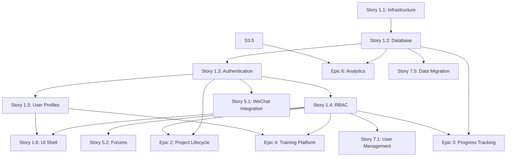

# SRMP Story Map & Dependencies

## Overview

This document provides a visual story map and dependency graph for the Scientific Research Management Platform (SRMP) project. The stories are organized by epic and sprint allocation.

## Story Map by Epic

### Epic 1: Foundation & Authentication Infrastructure (Sprint 1-5)
- **Story 1.1**: Initialize Project Infrastructure → **Sprint 1** (3 points)
- **Story 1.2**: Implement Database Schema and Migrations → **Sprint 2** (5 points)
- **Story 1.3**: Build Multi-Method Authentication Service → **Sprint 3** (8 points)
- **Story 1.4**: Implement Role-Based Access Control (RBAC) → **Sprint 4** (5 points)
- **Story 1.5**: Create User Profile Management → **Sprint 4** (3 points)
- **Story 1.6**: Develop Initial UI Shell and Navigation → **Sprint 5** (5 points)

### Epic 2: Research Project Lifecycle Management
- **Story 2.1**: Create Project Posting Interface for Professors
- **Story 2.2**: Build Project Discovery and Search
- **Story 2.3**: Implement Student Application System
- **Story 2.4**: Develop Professor Application Review Interface
- **Story 2.5**: Build AI-Powered Matching Algorithm
- **Story 2.6**: Implement Mutual Confirmation Workflow

### Epic 3: Progress Tracking & Milestone Management
- **Story 3.1**: Design Milestone Framework and Templates
- **Story 3.2**: Build Progress Submission Interface
- **Story 3.3**: Create Advisor Review and Feedback System
- **Story 3.4**: Implement Automated Progress Monitoring
- **Story 3.5**: Develop Progress Analytics and Reporting
- **Story 3.6**: Build Intervention and Support Tools

### Epic 4: Research Methodology Training Platform
- **Story 4.1**: Create Course Structure and Content Management
- **Story 4.2**: Develop Interactive Learning Components
- **Story 4.3**: Implement Assessment and Certification System
- **Story 4.4**: Build Progress Tracking and Gamification
- **Story 4.5**: Create Instructor Dashboard and Analytics

### Epic 5: Communication & Collaboration Tools
- **Story 5.1**: Integrate WeChat Work Notifications
- **Story 5.2**: Build Project Discussion Forums
- **Story 5.3**: Develop Feedback and Rating System
- **Story 5.4**: Create Meeting Scheduling and Calendar Integration
- **Story 5.5**: Implement Announcement and Broadcast System

### Epic 6: Analytics & Reporting Engine
- **Story 6.1**: Build Student Analytics Dashboard
- **Story 6.2**: Create Professor Analytics Interface
- **Story 6.3**: Develop Administrative Reports and Dashboards
- **Story 6.4**: Implement Predictive Analytics
- **Story 6.5**: Build Custom Report Generator

### Epic 7: Administrative Tools & Batch Operations
- **Story 7.1**: Build User Management Interface
- **Story 7.2**: Develop Batch Grade Processing
- **Story 7.3**: Create System Configuration Management
- **Story 7.4**: Implement Comprehensive Audit System
- **Story 7.5**: Build Data Migration and Integration Tools

## Critical Dependencies

### Technical Dependencies

### External Service Dependencies
1. **WeChat Work API** (Story 1.3, 5.1) - Registration required 2-3 weeks in advance
2. **University SSO** (Story 1.3) - Integration specifications needed
3. **Alibaba Cloud Services** (Story 1.1) - Account setup required
4. **Email/SMS Gateway** (Story 1.3, 5.1) - Vendor selection needed

### Data Dependencies
- Story 1.2 (Database Schema) blocks ALL data-related stories
- Story 1.4 (RBAC) blocks ALL role-specific features
- Story 3.1 (Milestone Framework) blocks progress tracking stories

### UI Dependencies
- Story 1.6 (UI Shell) blocks ALL frontend development
- Frontend framework selection impacts all UI stories

## Risk Mitigation Sequencing

### High-Risk Items to Address Early
1. **WeChat Work Integration** - Start registration in Sprint 1
2. **AI Matching Algorithm** - Spike in Sprint 2, simplify if needed
3. **Database Schema** - Complete design before Sprint 2
4. **Third-party Integrations** - Create mocks in Sprint 1

### Parallel Work Opportunities
- Sprint 1: Infrastructure setup + WeChat registration + Mock services
- Sprint 2: Database + Redis/Elasticsearch setup
- Sprint 4: RBAC implementation + User profile management
- Sprint 5: UI development + Documentation + Testing

## MVP Critical Path

The following stories form the critical path for MVP delivery:

1. Story 1.1 → 1.2 → 1.3 → 1.4 → 1.6 (Foundation)
2. Story 2.1 → 2.2 → 2.3 → 2.4 (Basic Project Matching)
3. Story 3.1 → 3.2 → 3.3 (Basic Progress Tracking)
4. Story 5.1 (Notifications)

Total MVP: ~15 stories delivering core functionality

## Post-MVP Prioritization

Based on value and complexity:

### Phase 2 (High Value, Lower Complexity)
- Epic 4: Research Methodology Training
- Story 2.5: AI Matching (if not in MVP)
- Story 3.4-3.5: Advanced Progress Analytics

### Phase 3 (High Value, Higher Complexity)
- Epic 6: Full Analytics Platform
- Epic 7: Advanced Admin Tools
- Story 5.4: Calendar Integration

## File Locations

- **Epics**: `/docs/prd/epics/` directory (8 files including epic-list.md)
- **Stories**: `/docs/stories/` directory (38 files)
- **PRD Sections**: `/docs/prd/` directory (15 files)
- **Architecture Sections**: `/docs/architecture/` directory (21 files)

## Usage Instructions

1. **For Sprint Planning**: Use stories in `/docs/stories/` as ready-to-implement work items
2. **For Development**: Each story file contains complete acceptance criteria
3. **For Dependencies**: Check this map before starting any story
4. **For Risk Management**: Prioritize high-risk dependencies early

## Maintenance

This story map should be updated when:
- New dependencies are discovered
- Story estimates change significantly
- External dependencies change
- Sprint allocation needs adjustment